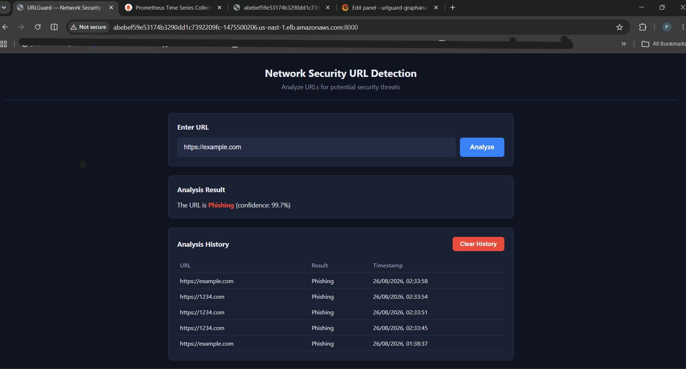
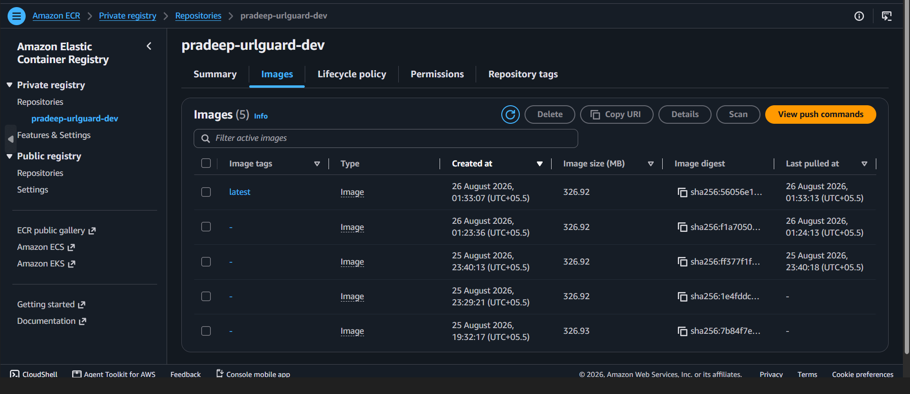
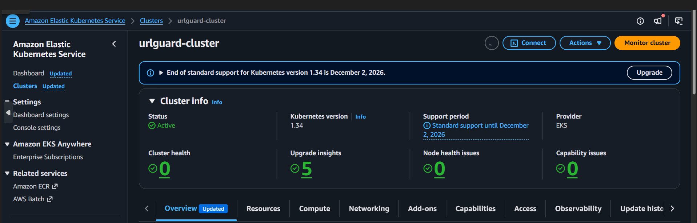
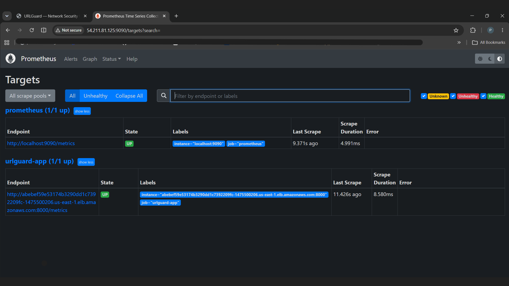
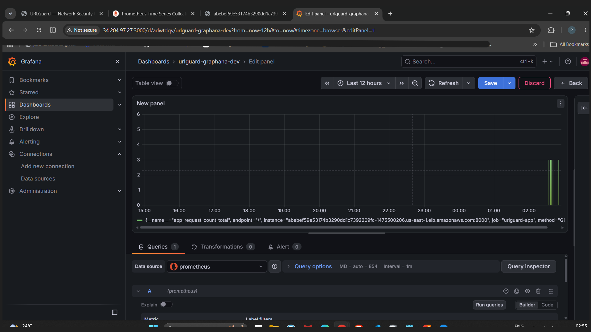
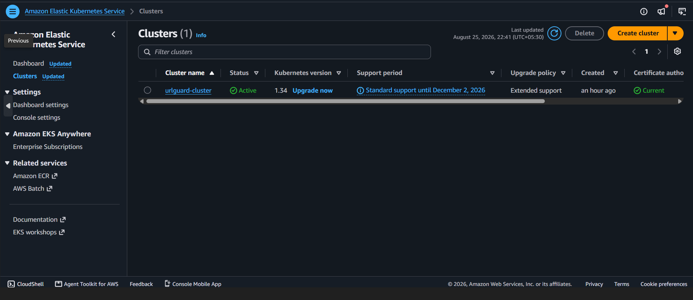
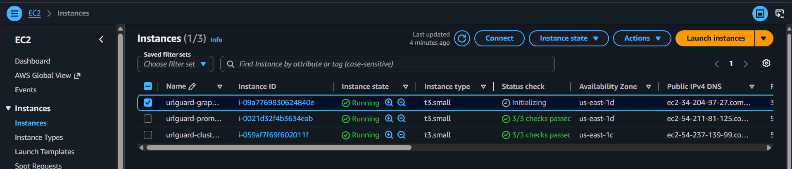
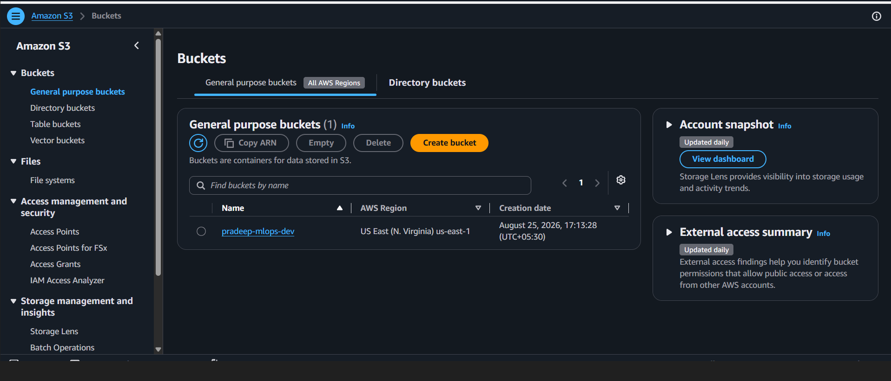
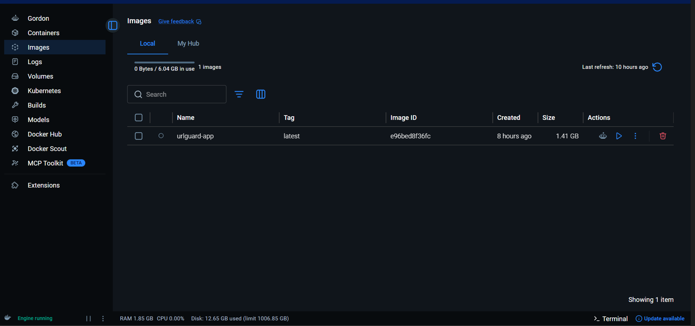
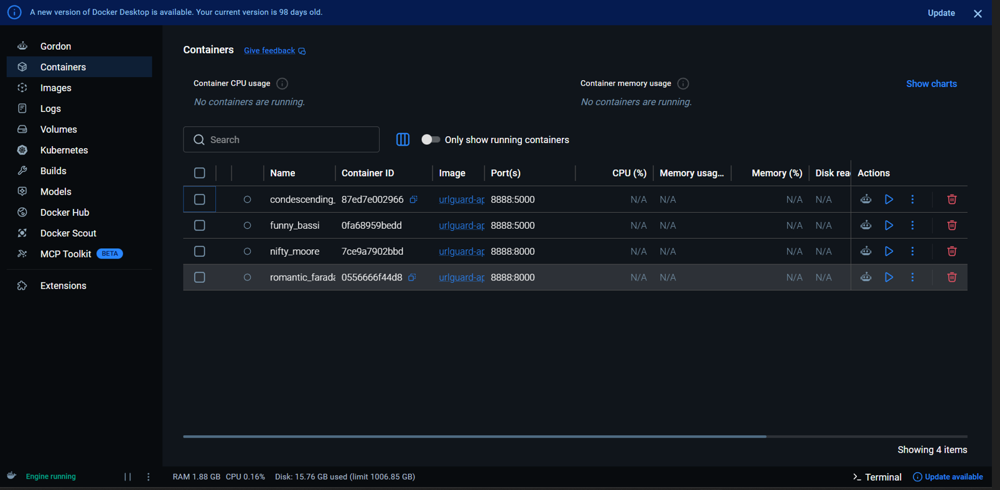

# 🛡️ URLGuard — Phishing URL Detection System

[](https://www.python.org/)
[](https://fastapi.tiangolo.com/)
[](https://www.docker.com/)
[](https://aws.amazon.com/eks/)
[](https://mlflow.org/)
[](https://dvc.org/)
[](https://github.com/features/actions)
[](LICENSE)

An end-to-end, production-grade MLOps pipeline that detects phishing URLs in real time. URLGuard covers the full machine learning lifecycle — versioned data, tracked experiments, a reproducible training pipeline, automated CI/CD, containerized deployment on Kubernetes, and live observability — built to reflect how ML systems are actually shipped and operated in industry, not just how models are trained in a notebook.

### Live Demo



The app deployed to Amazon EKS, serving live predictions behind a Kubernetes `LoadBalancer` Service.

---

## Table of Contents

- [Overview](#overview)
- [System Architecture](#system-architecture)
- [Tech Stack](#tech-stack)
- [Dataset](#dataset)
- [MLOps Pipeline](#mlops-pipeline)
- [Model Development](#model-development)
- [Serving Layer](#serving-layer)
- [CI/CD Pipeline](#cicd-pipeline)
- [Deployment](#deployment)
- [Monitoring & Observability](#monitoring--observability)
- [Screenshots](#screenshots)
- [Project Structure](#project-structure)
- [Getting Started](#getting-started)
- [Roadmap](#roadmap)
- [License](#license)

---

## Overview

Phishing URLs remain one of the most common attack vectors in network security, and detecting them reliably requires more than a one-off trained model — it requires a system: versioned data, reproducible experiments, automated retraining, safe promotion to production, and visibility into how the deployed model behaves under real traffic.

URLGuard is built around that principle. Given a URL, the system extracts lexical and live content-based features, runs inference through a registered production model, and returns a phishing/legitimate classification via a REST API — with every stage of the pipeline, from raw data to a running Kubernetes pod, automated and observable.

## System Architecture

```
┌──────────────┐   ┌──────────────┐   ┌──────────────────┐   ┌─────────────────┐
│  Data (DVC)  │──▶│  ML Pipeline  │──▶│  MLflow Registry  │──▶│   FastAPI App    │
│  PhiUSIIL     │   │ Preprocess →  │   │   (via DagsHub)   │   │  (Docker image)  │
│  dataset      │   │ Train → Eval  │   │  staging→prod     │   │                  │
└──────────────┘   └──────────────┘   └──────────────────┘   └────────┬─────────┘
                                                                          │
                          ┌───────────────────────────────────────────────┘
                          ▼
              ┌─────────────────────┐        ┌──────────────┐      ┌───────────┐
              │  Amazon ECR          │──────▶│  Amazon EKS   │────▶│ Prometheus │
              │  (image registry)    │  push  │  (K8s cluster)│      │  + Grafana │
              └─────────────────────┘        └──────────────┘      └───────────┘
                          ▲
                          │
              ┌─────────────────────┐
              │  GitHub Actions CI/CD │
              │  test → build → push  │
              │  → deploy              │
              └─────────────────────┘
```

## Tech Stack

| Category | Tools / Technologies | Purpose |
|---|---|---|
| **API / Serving** | FastAPI, Uvicorn, Gunicorn | Async REST API for real-time phishing prediction |
| **ML Models** | XGBoost, LightGBM, Random Forest, Logistic Regression | Model candidates benchmarked against a baseline |
| **Feature Engineering** | Scikit-learn `ColumnTransformer`, Requests, BeautifulSoup | URL-lexical + live HTML content-based feature extraction |
| **Data Versioning** | DVC | Reproducible, versioned datasets and pipeline stages |
| **Experiment Tracking** | MLflow (hosted via DagsHub) | Metrics, params, and model registry with staging/production aliasing |
| **Containerization** | Docker | Reproducible runtime environment for the serving app |
| **Container Registry** | Amazon ECR | Stores built application images |
| **Orchestration** | Kubernetes (Amazon EKS) | Container orchestration, scaling, service exposure |
| **CI/CD** | GitHub Actions | Automated testing, model promotion, image build/push, deployment |
| **Monitoring** | Prometheus, Grafana | Metrics scraping and real-time dashboards |
| **Infra Provisioning** | eksctl, AWS CLI | Cluster and infrastructure lifecycle management |
| **Cloud Storage** | Amazon S3 | Backing store for DVC-tracked data and pipeline artifacts |
| **Local Dev** | Docker Desktop | Local image builds and container testing before pushing to ECR |

## Dataset

URLGuard is trained on the **[PhiUSIIL Phishing URL Dataset](https://archive.ics.uci.edu/dataset/967/phiusiil+phishing+url+dataset)** from the UCI Machine Learning Repository:

- **235,795** total instances
- **134,850** legitimate URLs · **100,945** phishing URLs
- **54** engineered features per URL (lexical, structural, and content-based)

## MLOps Pipeline

The pipeline is fully version-controlled and reproducible end to end via **DVC**, with each stage isolated and independently re-runnable:

1. **Data Ingestion** — pulls the versioned dataset from the DVC remote
2. **Data Preprocessing** — cleaning, encoding, and a `ColumnTransformer`-based preprocessing pipeline
3. **Feature Engineering** — derives lexical URL features and, at inference time, live content-based features
4. **Model Building & Training** — trains candidate models with tracked metrics
5. **Model Evaluation** — compares candidates on held-out data
6. **Model Registration** — logs the run and registers the model to the MLflow Model Registry via DagsHub

Every pipeline run is tracked in MLflow — parameters, metrics (F1, precision, recall), and artifacts are logged automatically, giving a full audit trail from raw data to deployed model.

## Model Development

Model selection followed an iterative benchmarking process rather than committing to a single algorithm upfront:

- **Baseline:** Logistic Regression, to establish a performance floor
- **Candidates evaluated:** Random Forest, XGBoost, LightGBM
- **Final production model:** **XGBoost**, selected for the best balance of predictive performance and inference latency

Model promotion follows an **alias-based convention** in the MLflow Registry (`staging` → `production`) rather than blind versioning — a model is only promoted to production after passing automated tests in the CI pipeline, giving a controlled, auditable release gate.

## Serving Layer

The trained model is served through a lightweight **FastAPI** application:

- Loads the production-aliased model directly from the MLflow/DagsHub registry at startup (`models:/URLGuard_model@production`)
- Applies the saved preprocessor to incoming requests for consistent feature transformation
- Extracts live, content-based features (via `requests` + `BeautifulSoup`) in addition to static URL-lexical features
- Exposes a Prometheus-compatible `/metrics` endpoint for observability
- Runs under **Gunicorn** with **Uvicorn workers**, tuned for the container's resource limits in production

## CI/CD Pipeline

Fully automated via **GitHub Actions**, triggered on every push:

```
checkout → setup Python → install deps → dvc repro → run model tests
   → promote model (staging → production) → run FastAPI app tests
   → build Docker image → push to Amazon ECR
   → update kubeconfig → apply Kubernetes secrets → deploy to EKS
```

Key design decisions:
- **Two separate `requirements.txt` files** — a full one for training/DVC/CI tooling, and a lean, production-only one for the Docker image, keeping the deployed container minimal and avoiding dependency conflicts (e.g., DVC's S3 tooling vs. the serving app's runtime deps)
- **Secrets management** via GitHub Actions secrets and Kubernetes Secrets — no credentials committed to the repo
- **Image tagging and substitution** handled at deploy time, keeping Kubernetes manifests environment-agnostic

## Deployment

- **Containerization:** Multi-stage-friendly Dockerfile, layered for build caching (dependencies installed before app code is copied), tested locally via Docker Desktop before every push
- **Registry:** Images pushed to **Amazon ECR**
- **Orchestration:** Deployed to **Amazon EKS** via a Kubernetes `Deployment` (multi-replica) and a `LoadBalancer` `Service`
- **Resource management:** CPU/memory requests and limits tuned per pod to fit the node group's capacity

| ECR Image Registry | EKS Cluster |
|---|---|
|  |  |

## Monitoring & Observability

- **Prometheus**, self-hosted on EC2, scrapes the app's `/metrics` endpoint exposed via the LoadBalancer
- **Grafana**, self-hosted on EC2, connects to Prometheus as a data source for real-time dashboards on request rate, latency, and prediction outcomes

| Prometheus Targets | Grafana Dashboard |
|---|---|
|  |  |

## Screenshots

<details>
<summary>Click to expand full infrastructure walkthrough</summary>

**EKS Cluster**


**EC2 instances (Prometheus, Grafana, EKS-connected node)**


**Amazon S3 bucket (DVC / artifact storage)**


**Local Docker images**


**Local Docker containers**


</details>

## Project Structure

```
URLGuard/
├── app/                    # FastAPI serving application
│   ├── main.py
│   ├── templates/
│   └── requirements.txt    # lean, production-only dependencies
├── src/
│   ├── connections/
│   ├── data/                # ingestion, preprocessing
│   ├── features/             # feature engineering
│   ├── logger/
│   ├── model/                # training, evaluation, registration, prediction
│   └── visualization/
├── notebooks/               # exploratory analysis
├── images/                   # README screenshots
├── data/                     # DVC-tracked
├── models/                   # DVC-tracked artifacts (e.g. preprocessor.pkl)
├── scripts/
│   └── promote_model.py
├── tests/
├── docs/
├── reports/
├── deployment.yaml           # Kubernetes Deployment + Service
├── Dockerfile
├── dvc.yaml / dvc.lock / params.yaml
├── requirements.txt           # full training/CI dependencies
└── .github/workflows/ci.yaml
```

## Getting Started

**Clone the repository**
```bash
git clone https://github.com/<your-username>/URLGuard.git
cd URLGuard
```

**Install dependencies**
```bash
pip install -r requirements.txt
```

**Pull versioned data via DVC**
```bash
dvc pull
```

**Run the training pipeline**
```bash
dvc repro
```

**Run the API locally**
```bash
cd app
pip install -r requirements.txt
uvicorn main:app --host 0.0.0.0 --port 8000
```

**Or run via Docker**
```bash
docker build -t urlguard:latest .
docker run -p 8000:8000 urlguard:latest
```

## Roadmap

- [ ] Expand feature set with additional live-content signals
- [ ] Add model drift detection and automated retraining triggers
- [ ] Horizontal Pod Autoscaling based on Prometheus metrics
- [ ] Batch prediction endpoint for CSV uploads

